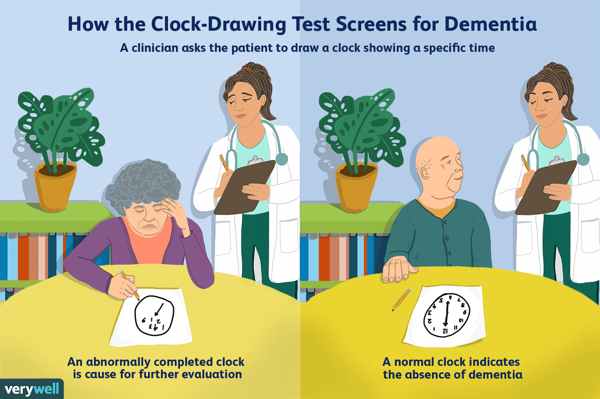
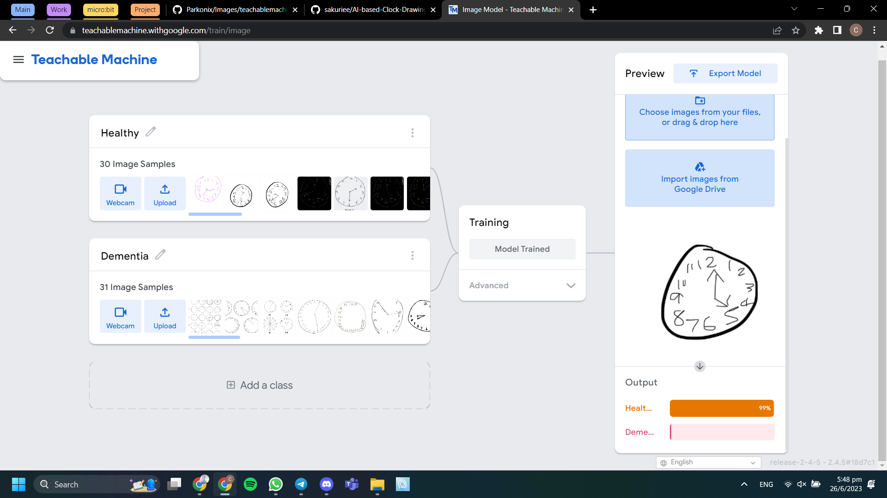
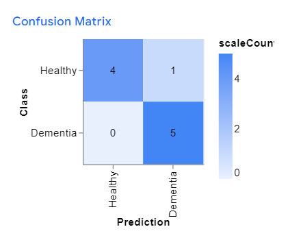
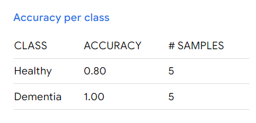
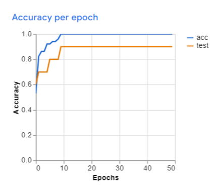
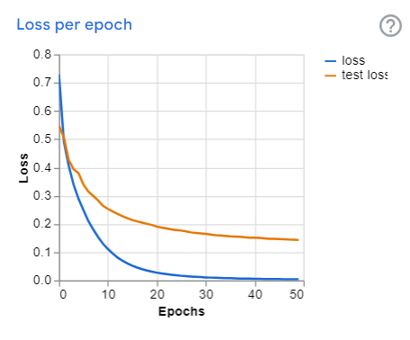

# AI-based Clock Drawing Test for Dementia

## AI-based Clock Drawing Test for Dementia - 85% Accurate Detection Algorithm.

<br>



<br>

The clock-drawing test is a simple tool used to check for signs of dementia, including Alzheimer’s disease. It is often used in combination with other screening tests but can provide valuable clues on its own. Detection Based on Handwriting Movement" by Rigas et al., this repository contains the implementation of Dementia using Teachable Machine.

<br>

## ⭐  Overview
The Clock-Drawing Test is a simple screening tool used to assess cognitive impairment, particularly in dementia. Individuals are asked to draw a clock face and set their hands to a specific time. Performance is evaluated based on elements like spatial organization, number placement, and clock-hand placement. Abnormalities may indicate a cognitive decline.

<br>

## ⭐  Features
* Dementia detection based on clock drawing images.
* Utilizes Teachable Machine, a user-friendly platform for training machine learning models.
* Achieves an accuracy rate of 85%, providing reliable results.
* Fast and efficient detection process.
* Easy to use and integrate into existing applications.

<br>

## ⭐  How to Use
1. Ensure that you have the necessary dependencies installed.
2. Obtain a dataset of clock drawing images.
3. Train the Dementia algorithm using Teachable Machine, providing the dataset as input.
4. Save the trained model and export it in a compatible format.
5. Integrate the Dementia algorithm into your application and utilize it for Dementia detection.

<br>

## ⭐  Model is developed on Teachable Machine

[Teachable Machine](https://teachablemachine.withgoogle.com/)



Teachable Machine is an innovative platform developed by Google that allows users to build custom machine learning models without the need for coding or extensive technical knowledge. The platform utilizes a simple drag-and-drop interface that allows users to input data and train machine learning models quickly and easily.

Teachable Machine has several features that make it an ideal tool for building custom machine learning models. Firstly, it allows users to train models using a variety of data types, such as images, sounds, and sensor data. Secondly, it provides users with the ability to choose from a range of pre-built machine learning models, such as image classification and sound recognition, or to build custom models from scratch.

<br>

## ⭐  To run these scripts, you need the following installed:

1. Python 3
2. The python libraries listed in requirements.txt
    * Try running "pip3 install -r requirements.txt"

### Step 1: Clone this repository
Run:
```bash
git clone https://github.com/SaiJeevanPuchakayala/Parkonix
```

### Step 2: Navigate to the Parkonix directory
Run:
```bash
cd Parkonix
```
### Step 3: Install the python libraries
Run:
```bash
pip install -r requirements.txt
```
### Step 4: Run the streamlitApp.py file
Run:
```bash
streamlit run streamlitApp.py
```

<br>

## ⭐ Streamlit Deployment Configurations:
```
[theme]
base="dark"

[browser]
gatherUsageStats = false
```

<br>

## ⭐ Few images illustrating model performance

## `Confusion Matrix`
> 
</b></b>

## `Accuracy Per Class`
> 
</b></b>

## `Accuracy Per Epoch`
> 
</b></b>

## `Loss Per Epoch`
> 

<br>

## ⭐ Deployment References:
1. https://30days.streamlit.app/
2. https://docs.streamlit.io/streamlit-community-cloud/get-started/deploy-an-app
3. https://streamlit-cloud-example-apps-streamlit-app-sw3u0r.streamlit.app/?hsCtaTracking=28f10086-a3a5-4ea8-9403-f3d52bf26184|22470002-acb1-4d93-8286-00ee4f8a46fb
4. https://docs.streamlit.io/library/advanced-features/configuration


<br>

## ⭐ Note:
### **If you find my GitHub repository useful, why not give it a star? It's like giving a little virtual high-five that makes my day!**

<br>
